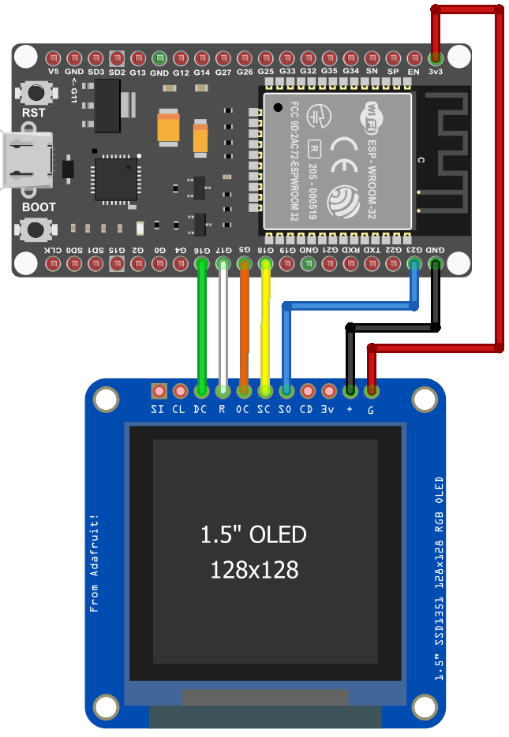

# TickerView

A real-time cryptocurrency and asset price display for ESP32 with SSD1351 OLED display. TickerView fetches live prices from Binance and displays them with historical percentage changes on a vibrant 128x128 OLED screen.

## Demo

[Demo Video ansehen](docs/TickerViewDemo.mp4)

*TickerView in action showing rotating assets with bounce animation*



## Features

- **Multi-Asset Support**: Display up to 4 different assets (cryptocurrencies, commodities, etc.)
- **Live Price Updates**: Automatic price fetching from Binance Futures API
- **Historical Tracking**: Shows percentage change over configurable time windows
- **Rotating Display**: Cycles through assets with smooth bounce animation to prevent OLED burn-in
- **Web Configuration**: Easy setup via browser-based interface
- **WiFi Connectivity**: Supports both Station (STA) and Access Point (AP) modes
- **Time Display**: NTP-synchronized clock with configurable timezone
- **Customizable**: Adjust update intervals, display time, decimal places, and more

## Hardware Requirements

### Components
- **ESP32 DevKit v1** board
- **SSD1351 OLED Display** (128x128 pixels, SPI interface)
- Jumper wires
- USB cable for programming

**Note:** The display uses a vertical bounce animation to protect the OLED from burn-in by preventing static content from remaining in the same position for extended periods.

### Wiring Diagram

See [docs/TickerView_BB.png](docs/TickerView_BB.png) for complete wiring instructions.

| ESP32 Pin | SSD1351 Pin | Function |
|-----------|-------------|----------|
| GPIO 18   | SCLK        | SPI Clock |
| GPIO 23   | DIN (MOSI)  | SPI Data |
| GPIO 5    | CS          | Chip Select |
| GPIO 16   | DC          | Data/Command |
| GPIO 17   | RST         | Reset |
| 3.3V      | VCC         | Power |
| GND       | GND         | Ground |

## Software Requirements

- **PlatformIO** (recommended) or PlatformIO Core CLI
- Visual Studio Code with PlatformIO extension (optional but recommended)

## Installation

### 1. Clone the Repository
```bash
git clone <repository-url>
cd TickerView
```

### 2. Open in PlatformIO
- Open Visual Studio Code
- Install the PlatformIO extension if not already installed
- Open the project folder: `File > Open Folder` and select the `TickerView` directory

### 3. Configure Credentials

**Important:** Before building, you must configure your WiFi and web interface credentials.

1. Navigate to the `include` folder
2. Copy `secrets_template.h` to `secrets.h`:
   ```bash
   cp include/secrets_template.h include/secrets.h
   ```
3. Edit `include/secrets.h` with your credentials:
   ```cpp
   #define AP_PASSWD   "your-ap-password"      // Access Point password (min 8 chars)
   #define WIFI_SSID   "your-wifi-name"        // Your WiFi network name
   #define WIFI_PASSWD "your-wifi-password"    // Your WiFi password
   #define WEB_USER    "admin"                 // Web interface username
   #define WEB_PASSWD  "admin"                 // Web interface password
   ```

**Note:** The `secrets.h` file is excluded from version control (.gitignore) to protect your credentials.

### 4. Build the Project
PlatformIO will automatically install all required dependencies:
- ESPAsyncWebServer
- Adafruit SSD1351 Library
- Adafruit GFX Library
- ArduinoJson

Build the project:
```bash
pio run
```

Or use the PlatformIO toolbar in VS Code.

### 5. Upload to ESP32
Connect your ESP32 via USB and upload:
```bash
pio run --target upload
```

Or click the upload button in the PlatformIO toolbar.

### 6. Monitor Serial Output (Optional)
```bash
pio device monitor
```

## Configuration

### Initial Setup

On first boot, TickerView will:
1. Start in Access Point (AP) mode
2. Create a WiFi network named according to your configuration
3. Display the configuration IP address on the OLED screen

### Web Interface Access

**Default AP Mode IP:** `10.100.10.1`

1. Connect to the TickerView WiFi network
2. Open a web browser and navigate to `http://10.100.10.1`
3. Configure your settings (see below)

[WebPrefs UI demo](docs/WebPrefs.mp4)

*WebPrefs configuration interface walkthrough*

### Configuration Options

#### Asset Settings (Up to 4 Assets)

For each asset (1-4), configure:

| Setting | Description | Example |
|---------|-------------|---------|
| Symbol  | Binance symbol (max 16 chars) | `BTCUSDT` |
| Asset Name | Display name (max 6 chars) | `BTC` |
| Digits | Decimal places (1-7) | `2` |

**Default Assets:**
- Asset 1: Bitcoin (BTCUSDT / BTC)
- Asset 2: Ethereum (ETHUSDT / ETH)
- Asset 3: Gold (XAUUSDT / XAU)
- Asset 4: Silver (XAGUSDT / XAG)

#### Display Settings

| Setting | Description | Range | Default |
|---------|-------------|-------|---------|
| Price Update | Update interval in minutes | 1-60 | 1 |
| Display Time | Seconds per asset | 1-60 | 5 |
| History Window | Hours for % change calculation | 1-24 | 12 |
| X Offset | Horizontal position offset | 0-10 | 5 |
| Show Percent | Display percentage change | On/Off | On |
| Show HW | Show history window in % display | On/Off | On |
| Show HP | Show historical price | On/Off | On |
| Show Time | Display clock | On/Off | On |

#### WiFi Settings

| Setting | Description |
|---------|-------------|
| SSID | Your WiFi network name |
| Password | WiFi password (min 8 chars) |
| AP Only | Run in Access Point mode only |
| AP Password | Password for AP mode (min 8 chars) |
| AP Channel | WiFi channel (1-13) |
| AP Fallback | Fallback to AP after connection failures |
| Static IP | Enable static IP configuration |

#### NTP/Time Settings

| Setting | Description | Default |
|---------|-------------|---------|
| NTP Enabled | Enable time synchronization | Off |
| NTP Server | Time server address | `ts1.univie.ac.at` |
| GMT Offset | Timezone offset in seconds | 0 |
| Daylight Offset | DST offset in seconds | 0 |
| TZ String | POSIX timezone string | `CET-1CEST,M3.5.0/2,M10.5.0/3` |

#### Web Interface Security

| Setting | Description |
|---------|-------------|
| Web Auth | Enable authentication |
| Username | Login username (min 3 chars) |
| Password | Login password |
| Idle Timeout | Session timeout in minutes |

## Usage

Once configured, TickerView will:

1. **Connect to WiFi** (if STA mode is enabled)
2. **Fetch initial prices** from Binance
3. **Display assets** in rotation:
   - Asset name
   - Current price
   - Percentage change (color-coded: green = up, red = down)
   - Historical price (if enabled)
   - Current time (if enabled)
4. **Update prices** automatically at configured intervals
5. **Cycle through assets** with vertical bounce animation (prevents OLED burn-in by continuously shifting the display position)

### Display Colors

- **Yellow**: Asset name and neutral change
- **Green**: Positive price change
- **Red**: Negative price change
- **Cyan**: Time display

## Data Source

TickerView fetches data from the **Binance Futures API**:
```
https://fapi.binance.com/fapi/v1/premiumIndex?symbol=<SYMBOL>
```

The API provides:
- Real-time index prices
- No API key required for public data
- Rate limits apply (be mindful of update intervals)

## Build Environments

The project includes three build configurations:

- **esp32doit-devkit-v1-debug**: Debug build with verbose logging
- **esp32doit-devkit-v1-release**: Optimized release build (default)
- **esp32doit-devkit-v1**: Standard build

Select environment in `platformio.ini` or via PlatformIO UI.

## Troubleshooting

### Display Not Working
- Verify wiring connections (see diagram)
- Check SPI pins match your ESP32 variant
- Ensure 3.3V power supply is adequate

### WiFi Connection Issues
- Verify SSID and password in web configuration
- Check WiFi signal strength
- Try AP fallback mode
- Look for serial output for error messages

### Price Not Updating
- Verify internet connectivity
- Check Binance API availability
- Ensure symbol names are correct (e.g., `BTCUSDT` not `BTC`)
- Monitor serial output for API errors

### Web Interface Not Accessible
- Ensure device is in AP mode or connected to your network
- Check IP address displayed on OLED screen
- Try default AP IP: `10.100.10.1`
- Verify web server started (check serial output)

## Development

### Project Structure
```
TickerView/
├── src/
│   ├── main.cpp              # Main application logic
│   ├── display.cpp/h         # Display functions
│   ├── network.cpp/h         # WiFi and API functions
│   ├── storage.cpp/h         # Configuration storage
│   ├── globals.cpp/h         # Global variables
│   ├── config/
│   │   ├── hardware.h        # Pin definitions
│   │   ├── webPrefsConfig.h  # Web UI configuration
│   │   └── webPrefsMacros.h  # Configuration macros
│   └── html/                 # Web interface files
├── docs/
│   └── TickerView_BB.png     # Wiring diagram
├── platformio.ini            # PlatformIO configuration
└── README.md                 # This file
```

### Adding Custom Assets

You can track any asset available on Binance Futures:

1. Find the symbol on [Binance Futures](https://www.binance.com/en/futures)
2. Enter the full symbol in the web configuration (e.g., `BTCUSDT`, `ETHUSDT`)
3. Set a short display name (max 6 characters)
4. Configure appropriate decimal places for the asset

### Modifying the Code

The code is structured for easy customization:

- **Display layout**: Edit `display.cpp` functions
- **API source**: Modify `getPrice()` in `network.cpp`
- **Update intervals**: Adjust via web config or defaults in `webPrefsConfig.h`
- **Number of assets**: Change `NUM_ASSETS` in `globals.h` (requires code changes for >4 assets)

## License

MIT License

Copyright (c) 2026 Seizu

Permission is hereby granted, free of charge, to any person obtaining a copy
of this software and associated documentation files (the "Software"), to deal
in the Software without restriction, including without limitation the rights
to use, copy, modify, merge, publish, distribute, sublicense, and/or sell
copies of the Software, and to permit persons to whom the Software is
furnished to do so, subject to the following conditions:

The above copyright notice and this permission notice shall be included in all
copies or substantial portions of the Software.

THE SOFTWARE IS PROVIDED "AS IS", WITHOUT WARRANTY OF ANY KIND, EXPRESS OR
IMPLIED, INCLUDING BUT NOT LIMITED TO THE WARRANTIES OF MERCHANTABILITY,
FITNESS FOR A PARTICULAR PURPOSE AND NONINFRINGEMENT. IN NO EVENT SHALL THE
AUTHORS OR COPYRIGHT HOLDERS BE LIABLE FOR ANY CLAIM, DAMAGES OR OTHER
LIABILITY, WHETHER IN AN ACTION OF CONTRACT, TORT OR OTHERWISE, ARISING FROM,
OUT OF OR IN CONNECTION WITH THE SOFTWARE OR THE USE OR OTHER DEALINGS IN THE
SOFTWARE.

## Credits

Built with:
- [PlatformIO](https://platformio.org/)
- [Adafruit SSD1351 Library](https://github.com/adafruit/Adafruit-SSD1351-library)
- [Adafruit GFX Library](https://github.com/adafruit/Adafruit-GFX-Library)
- [ESPAsyncWebServer](https://github.com/me-no-dev/ESPAsyncWebServer)
- [ArduinoJson](https://arduinojson.org/)
- [Binance API](https://www.binance.com/en/binance-api)

## Support

For issues, questions, or contributions, please [open an issue](../../issues) on GitHub.

---

**Note**: This project is for educational and personal use. Always respect API rate limits and terms of service when fetching data from external sources.
